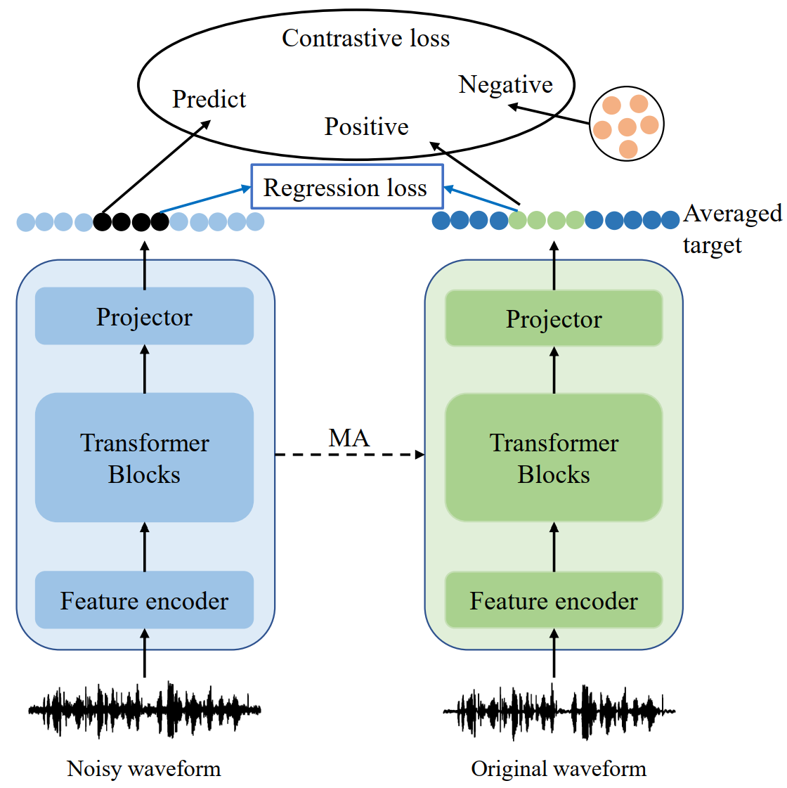

## Robust data2vec: Noise-robust speech representation learning for ASR by combining regression and improved contrastive learning

### Introduction

This is the code for the above paper.

The contrastive learning task and the regression task are jointly trained in the pre-training phase, and additional non-semantic negative samples are constructed to improve the noise robustness of the model.



### Usage

#### Prepare data manifest

```python
python examples/wav2vec/wav2vec_manifest.py /path/to/waves --dest /manifest/path --ext $ext --valid-percent $valid
```

#### Pre-train a data2vec_noisy Base model. 

The specific script can be found in [run_pretrain_chime4_1.sh](examples/data2vec_noisy/scripts/run_pretrain_chime4_1.sh)

```shell
#!/bin/bash

ngpu=$1
updatefreq=$2

model_path=/path/to/save_model

python /path/to/fairseq/fairseq_cli/hydra_train.py \
       --config-dir /path/to/fairseq/examples/data2vec_noisy/config/audio/pretraining \
       --config-name base_librispeech \
       common.user_dir=/path/to/fairseq/examples/data2vec_noisy \
       checkpoint.save_dir=${model_path} \
       hydra.run.dir=${model_path} \
       task.data=/path/to/chime_tsv_file \
       distributed_training.distributed_world_size=${ngpu} \
       optimization.update_freq=[${updatefreq}] \
       optimization.max_update=100000  \
       optimization.lr=[0.0001] \
       distributed_training.ddp_backend=no_c10d \
       dataset.max_tokens=3000000 \
       +task.noise_data_path=/path/to/noise_data_manifest \
       +task.noise_snr=\"0,25\" \
       common.log_interval=200 \
       checkpoint.reset_optimizer=True \
       checkpoint.reset_dataloader=True \
       +model.small_scale=0.1 \
       +model.large_scale=0.15 \
       +model.num_negatives=50 \

```

#### Finetune a data2vec_noisy Base model. 

The specific script can be found in [finetune_chime4_1.sh](examples/data2vec_noisy/scripts/finetune_chime4_1.sh)

```shell
#!/bin/bash

ngpu=$1
updatefreq=$2
model_path=/path/to/save_finetune_model


python /path/to/fairseq/fairseq_cli/hydra_train.py \
       --config-dir /path/to/fairseq/examples/data2vec_noisy/config/audio/finetune \
       --config-name chime4 \
       common.user_dir=examples/data2vec_noisy \
       checkpoint.save_dir=${model_path} \
       hydra.run.dir=${model_path} \
       task.data=/path/to/chime_tsv_file \
       model.w2v_path=/path/to/pretrained_model \
       distributed_training.distributed_world_size=${ngpu} \
       optimization.update_freq=[${updatefreq}] \
       task.normalize=True \
       lr_scheduler.phase_ratio=[0.3,0.2,0.5] \
       common.seed=1234 \
```

#### Decode a data2vec_noisy Base model. 

The specific script can be found in [infer_ctc_chime4.sh](examples/data2vec_noisy/scripts/infer_ctc_chime4.sh)

```shell
#!/bin/bash
subset=test
path=/path/to/finetuned_model
model=checkpoint_best.pt

mkdir -p ${path}/${subset}_${model}

python /path/to/fairseq/examples/speech_recognition/new/infer.py \
       --config-dir /path/to/fairseq/examples/speech_recognition/new/conf \
       --config-name infer task=audio_finetuning \
       common.user_dir=examples/data2vec_noisy \
       task.data=/path/to/chime_tsv_file \
       task.labels=ltr \
       decoding.type=viterbi \
       dataset.gen_subset=${subset} \
       common_eval.path=${path}/${model} \
       distributed_training.distributed_world_size=1 \
       common_eval.results_path=${path}/${subset}_${model} \
       decoding.results_path=${path}/${subset}_${model} \
```

The model files can be found in [data2vec_audio.py](examples/data2vec_noisy/models/data2vec_audio.py).

#### (Optional) Train a Transformer Language Model

First prepare the text data set (`wsjfull.train.tokens`, `wsjfull.valid.tokens`, `wsjfull.test.tokens`) and `dict_65000.txt`, and run the following shell script.

```shell
TEXT=/path/to/wsj_lm_text

python /path/to/fairseq/fairseq_cli/preprocess.py \
     --only-source \
     --srcdict $TEXT/dict_65000.txt \
     --trainpref $TEXT/wsjfull.train.tokens \
     --validpref $TEXT/wsjfull.valid.tokens \
     --testpref $TEXT/wsjfull.test.tokens \
     --destdir /path/to/wsj_lm_bin \
     --workers 20 \
```

We can train the language model using the following shell script.

```shell
python /path/to/fairseq/fairseq_cli/train.py --task language_modeling \
   /path/to/wsj_lm_bin \
   --save-dir /path/to/transformer_lm_1 \
   --arch transformer_lm --share-decoder-input-output-embed \
   --dropout 0.3 \
   --optimizer adam --adam-betas '(0.9, 0.98)' --weight-decay 0.01 --clip-norm 0.0 \
   --lr 0.001 --lr-scheduler reduce_lr_on_plateau --lr-shrink 0.1 --warmup-updates 10000 \
   --tokens-per-sample 512 --sample-break-mode none \
   --max-tokens 4096 \
   --fp16 \
   --max-update 50000 \
   --decoder-layers 16 \
   --decoder-embed-dim 512 \
   --decoder-ffn-embed-dim 2048 \
   --attention-dropout 0.3 \
   --decoder-normalize-before \
   --update-freq 4
```

### Pre-trained model

You can download the pre-trained model from [Pretrained model](https://drive.google.com/file/d/1oTuXzkq9youiJIIxq9bIPY_JKo3TiKi-/view?usp=sharing).


### Reference Code

1. fairseq[facebookresearch/fairseq: Facebook AI Research Sequence-to-Sequence Toolkit written in Python. (github.com)](https://github.com/facebookresearch/fairseq)
2. data2vec model [fairseq/examples/data2vec at main · facebookresearch/fairseq (github.com)](https://github.com/facebookresearch/fairseq/tree/main/examples/data2vec)
3. [SongweiGe/Contrastive-Learning-with-Non-Semantic-Negatives: Robust Contrastive Learning Using Negative Samples with Diminished Semantics (NeurIPS 2021) (github.com)](https://github.com/SongweiGe/Contrastive-Learning-with-Non-Semantic-Negatives)
